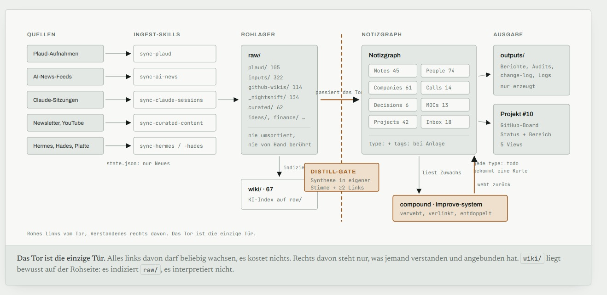
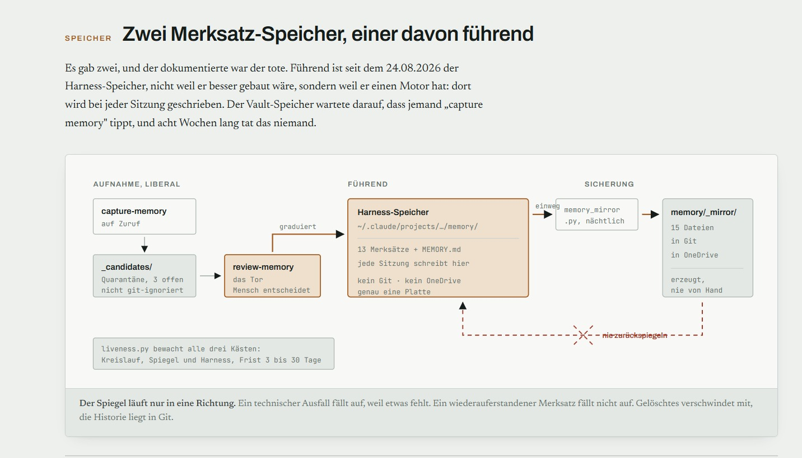

# Hi, I'm Eugen 👋

### AI Solutions Consultant for Procurement: I turn procurement pain into working AI, and I demo it live. | Berlin 🇩🇪

> **The one-liner:** I build the tools I wished existed when I ran the function, and every one below is live and clickable.

<!-- ▶ 2-min demo video: paste your Loom/YouTube link here. It's the single highest-impact addition to this profile -->

10+ years leading procurement and category management at **TeamViewer**, **Scout24**, **Foodpanda** and **Delivery Hero**, now engineering the AI systems that will transform the function I know inside out.

I don't just advise on AI transformation. I build the tools myself.

Every project here started from a real problem I encountered running procurement teams: manual triage, supplier compliance gaps, fragmented spend data, slow RFP cycles, and market intelligence that arrives too late. These are my answers, designed by someone who has lived them and built by someone who can now ship them.

AI Integration Bootcamp @ Ironhack · MBA-IT. I ship the tools, not just the slides. Every project below is live and demoable.

  

---

## Procurement AI Transformation

*Every build below started from a real pain I lived running procurement teams. Read the table for the problem → what I built → the result; expand any project for the engineering depth.*

| # | Problem (the pain I lived) | What I built | Result | Links |
|---|---|---|---|---|
| 🧠 **TrueSpend** | Category managers drown in manual PR triage, scattered approvals across IT/legal/controlling, and spend nobody can see end-to-end. | An AI-native procurement OS running the full purchase-to-invoice lifecycle autonomously. | 17 autonomous workflows, intake→invoice hands-off, role-gated ops board, money-moves locked at the database layer. | [GitHub](https://github.com/eugnmueller-87/TrueSpend) · [Demo](https://intake-production-84a0.up.railway.app) |
| 📦 **SCM-Master** | Procurement, warehouse flow, and asset lifecycle live in disconnected systems: no single source of truth, no safe automation. | An AI-native supply-chain OS unifying all three, with an autonomous weekly purchasing run that a human still gates. | Auto-places demand-justified POs only at **≥0.90 confidence & <€200k**, proven by a 29-scenario agent-safety harness; CI-gated, twin-deployed. | [GitHub](https://github.com/eugnmueller-87/SCM-Master) · [Demo](https://scm-master-production.up.railway.app) |
| 📈 **SCM Power BI Cockpit** | A non-technical CEO asks "should we invest in AI demand forecasting?" and gets hype, not a decision. | A consulting-case cockpit: live 7-tab web dashboard + Power BI report on the same data, backed by cited research. | A defensible **invest / wait / pilot** recommendation with WMAPE/Bias accuracy, should-cost & TCO, and a phased plan. | [GitHub](https://github.com/eugnmueller-87/SCM-POWER-BI) · [Dashboard](https://scm-power-bi-production.up.railway.app/) |
| 🔴 **SpendLens** | Raw vendor spend arrives as messy CSVs: no classification, no compliance view, no supplier intelligence a category manager can act on. | A 5-stage AI pipeline: map → clean → classify vendors → flag compliance → surface supplier intel, across 7 decision screens. | Upload a spend file, get a classified, compliance-scored, DD-linked view, hardened for public deployment. | [GitHub](https://github.com/eugnmueller-87/PROCUREMENT) · [Demo](https://procurement-production-f940.up.railway.app) |
| 🤝 **Negotiation Agent** | Supplier negotiations anchor on price alone, so buyers leave win-win trades on the table, and nobody trusts an LLM to hold a walk-away line. | A **deployed** negotiation tool where the LLM has zero authority: a deterministic engine makes every accept/counter/walk-away call and fixes the exact figures a reply may state. A violating draft is rejected and redrafted server-side before it's ever sent. Real Opus writes the buyer's emails live; you play either seat. **Walk in prepared:** upload a contract → it extracts the deal (price, expiry, licenses, NDA/DPA), researches the supplier via my **Hades** agent, and proposes how the intelligence should *shape the mandate* (give/hold/hedge) via a deterministic rule table a human approves, so the LLM never edits the envelope. | At matched buyer cost, logrolling leaves the supplier **+0.27 utility** vs splitting the difference, a runnable eval. 183 tests, mypy-strict, CI-green, live on Railway. | [▶ Live demo](https://web-production-a5b7b.up.railway.app/) · [GitHub](https://github.com/eugnmueller-87/Negotiation-Agent) |
| ☠️ **Hades** | Supplier due-diligence (sanctions, registry, ESG, LkSG/CSDDD) takes analysts 1–2 days per supplier. | An autonomous agent that screens a company across 6 risk sources in parallel and returns a scored verdict. | **Full risk report in under 2 minutes:** sanctions/registry/ESG/news → risk score 1–10 + Approve/Block. | [GitHub](https://github.com/eugnmueller-87/hades) |
| 🔍 **Hermes** | Supplier market intelligence arrives too late: you learn a key supplier is in trouble after it hurts you. | A continuous market-intelligence agent watching a curated supplier list across 5 signal sources. | Tracks **56 AI suppliers across 8 categories**, classifies + delta-tracks signals, feeds DD and the CM on demand. | [GitHub](https://github.com/eugnmueller-87/hermes-agent) |
| 🏗 **Triage Agent** | Purchase requests pile up waiting for a human to route, compliance-check, and chase suppliers. | An autonomous agent that triages every PR: value-routes, checks NDA/DPA/MSA via RAG, runs RFQ/RFP outreach, recommends an award. | 6 importable n8n workflows replacing the manual triage queue end-to-end. | [GitHub](https://github.com/eugnmueller-87/IRONHACK/tree/main/WEEK%204/LAB4) |
| 📊 **Marketing Spend Stats** | A $500K budget is split across 7 channels on gut feel, not evidence. | A full statistical pipeline testing every channel-pair for real CPA difference. | All 14 CPA pairs significant post-FDR → an executive memo with a data-backed reallocation. | [GitHub](https://github.com/eugnmueller-87/IRONHACK/tree/main/Week%206/LAB%209/lab_statistical_analysis_eugen_mueller) |
| 🧪 **LLM Eval Lab** | "Is this AI answer actually good enough to trust for procurement compliance Q&A?", usually answered by vibes. | A LangSmith evaluation lab that scores answers objectively and A/B-compares models. | LLM-as-judge on correctness + completeness over a custom dataset; gpt-4o-mini vs gpt-4o compared on real numbers. | [GitHub](https://github.com/eugnmueller-87/Rating-System-for-AI-Responses) |

<b>🔧 Engineering depth (click to expand, for technical reviewers)</b>

- **TrueSpend:** n8n + Claude Sonnet 4.6 + PostgreSQL + React. 17 autonomous workflows, 32-table schema (dbmate-migrated), full P2I lifecycle. Role-gated Operations Board (procurement, IT, controlling, legal, admin). 4-agent compliance onboarding, DocuSign JWT Grant, Grafana, Jira ≥€100k. **DB-enforced security:** NOSUPERUSER PostgREST role, every status transition through SECURITY DEFINER RPCs, `PATCH tickets.status` → 403 at the database layer. **Agent security:** inbound email/invoices run under "the LLM advises, deterministic code decides", model output is schema-validated against an action allowlist, ticket/PO ids are derived deterministically (never from the model), and a prompt-injection repro proves the guard inert; money RPCs gated fail-closed off the browser token.
- **SpendLens:** React 18 SPA + FastAPI. 5-stage AI pipeline persisted to per-client SQLite (immutable raw layer, hash-dedup, recomputable enrichment). 7 screens wired to **Hades** and **Hermes**. **Security-hardened for public deployment:** opt-in shared-secret API auth (constant-time compare, docs disabled in prod), scoped CORS + full security-header/CSP middleware, chunked upload guards (type allowlist + 25 MB cap), per-IP rate limiting on Anthropic-billed endpoints, Pydantic-validated Hades proxy (SSRF surface closed), generic client errors with server-side logging. **Production-polished frontend:** React production builds + SRI, pre-paint theme, keyboard-accessible shell (focus-visible, ARIA), reduced-motion, error boundary that keeps the shell alive on crashes.
- **Negotiation Agent:** a **deployed** procurement negotiator ([▶ live](https://web-production-a5b7b.up.railway.app/)) where the LLM has zero authority. A stateless FastAPI backend runs the real deterministic engine: buyer utility `U = Σ wᵢ·vᵢ(xᵢ)`, acceptance on a **Boulware concession curve** (`(t/T)^β, β>1`, a spec bug I caught: the original exponent was inverted, conceding early and surrendering leverage), counteroffers via **logrolling** (an exact fractional-knapsack LP that concedes on terms the buyer weights lightly but the supplier values highly, not a price split). **The guard is mechanical, not a prompt:** each turn the server folds the transcript, the engine decides, Opus drafts the buyer's email, and a **guard-with-redraft loop** rejects any figure the engine didn't approve, a violating draft is redrafted (or replaced by a deterministic template) *before it's ever sent*. Real Opus (buyer) + Haiku (supplier); HMAC-signed mandates; you play either seat. **Contract intelligence, the "prepared buyer":** upload a contract → deep extraction (price, expiry, licenses, NDA/DPA, units) + supplier due-diligence via my deployed **Hades** agent → a **deterministic finding→mandate transform** (21 property tests) that proposes bounded, reversible envelope adjustments tagged give/hold/hedge, the LLM extracts and observes, a pure-Python rule table maps findings to deltas, and a **human approves the diff before signing**. That's *"LLM advises, code decides"* extended to mandate construction: the model's confidence is collapsed to a discrete assurance in Python first, so it never becomes a mandate number. Proven +0.27 supplier utility at matched buyer cost (runnable `neg-sim --baseline`); headless agent-vs-agent simulator with hidden-preference personas and bit-identical audit replay. **183 tests · 92.9% coverage · mypy --strict · CI green** (ubuntu+windows × py3.11–3.13). Architecture designed with Claude Fable 5; full design in [`docs/`](https://github.com/eugnmueller-87/Negotiation-Agent/tree/main/docs).
- **Hades:** POST a company name → 6 parallel LangGraph nodes: OFAC/UN sanctions, NorthData registry, LkSG/CSDDD signals, ESG, news sentiment, Hermes intel. Risk score 1–10 + Approve/Block recommendation, in under 2 minutes.
- **Hermes:** 5 crawlers (RSS, EDGAR, Tavily, Jobs, Earnings) over a curated 56-supplier / 8-category watchlist, architecture scales to hundreds. Signals classified by Claude Haiku with delta tracking. Semantic RAG via Upstash Vector.
- **SCM-Master:** FastAPI + SQLAlchemy 2.0 + Pydantic 2 (SQLite→Postgres), JWT role-gating, **52 test files · CI-gated ≥80% coverage**, 5-job CI (lint · Postgres · SAST · CVE-audit · agent-safety). Multi-sourcing core: `Product` decoupled from `ProductSupplier`, re-sourcing a line is one FK repoint. Serial-tracked `Asset` traced RECEIVED→…→DISPOSED with an unbroken link to its PO line. Autonomous weekly purchasing run under **"the LLM advises, deterministic code decides"**, the **confidence score is itself deterministic and audited**, gating auto-place at **≥0.90 & <€200k**, proven by a **29-scenario agent-safety harness** (unapproved supplier, over-cap spend, prompt injection, poisoned calibration → refuses every time). **Inventory science:** **Syntetos–Boylan** demand classifier → **Nixtla `statsforecast`** (Croston/SBA) with **conformal prediction-interval safety stock**, chosen over a hand-rolled TSB on a walk-forward benchmark; service-level safety stock (`z × σ`) + **ABC** class service levels. **Learning layer:** rule-based calibration from human approve/reject, with a **LightGBM + SHAP** calibrator in **shadow mode**, advisory, logged, never deciding. **Twin-deployed** (self-wiring public demo + forge-locked production that refuses to seed/ship demo accounts/run on non-persistent storage, regression-tested). **Cost-intelligence:** clean-sheet **should-cost engine** (commodity-indexed → defensible cost floor + target price, DRAM/NAND sensitivity) + per-asset **TCO** rolling up to **TSCMC %**, deterministic engines, the LLM only proposes.
- **SCM Power BI Cockpit:** synthetic-data generator → 7 internally-consistent CSVs feed a live auto-refreshing 7-tab web cockpit (Node + Chart.js) **and** a Power BI report on the same live API, DAX anchored to **SCOR DS**, forecast accuracy (WMAPE / Bias / RMSE), should-cost & TCO. Backed by cited research (Stanford AI Index, McKinsey, chip-geopolitics) driving a hype-vs-evidence invest/wait/pilot call with a phased plan + cost/timeline.
- **Triage Agent:** 5-tier value routing, supplier NDA/DPA/MSA compliance check via RAG, RFQ/RFP generation, multi-supplier outreach, evaluation matrix, award recommendation. 6 importable n8n workflows.
- **Marketing Spend Stats:** Welch t-tests, Bonferroni + BH-FDR correction, bootstrap CIs, Cohen's d across 7 channels / 14 CPA pairs.
- **LLM Eval Lab:** LangSmith, custom 20-example dataset, LLM-as-judge correctness + completeness evaluators, A/B (gpt-4o-mini vs gpt-4o).

<b>📋 Case study: Hades, supplier due-diligence, framed as a client engagement</b>

*How I'd scope, build, and hand off this solution for a procurement client, the way I'd run it as a consultant, not just a repo.*

**The problem.** Under Germany's LkSG (and the incoming EU CSDDD), every material supplier must be screened for sanctions, ownership, ESG, and human-rights risk, and re-screened on change. In most teams this is a 1–2 day manual analyst task per supplier: pull the registry, check OFAC/UN lists, scan news, cross-reference ESG databases, write it up. It doesn't scale, it's inconsistent between analysts, and it's the exact task that stalls onboarding.

**The approach.** I treated it as a decision-support problem, not a chatbot. The rule throughout: *the LLM advises, deterministic code decides.* Sanctions matching runs in deterministic code **before** the model sees anything, a hit forces `Block`, no LLM discretion. The model only summarizes and scores what verified sources return, so the output is defensible to an auditor.

**What I built.** An agent that takes a company name and runs 6 research pipelines in parallel, sanctions (OFAC SDN + UN), registry (NorthData), LkSG/CSDDD signals, ESG/labour, 90-day news sentiment, and live market intelligence, then returns a 1–10 risk score with an Approve / Conditional / Block recommendation and a plain-language executive summary, with a persistent audit trail.

**The result.** A 1–2 day analyst task becomes a **sub-2-minute, consistent, audit-trailed report**, the same rubric every time, defensible to compliance, and wired into the wider spend platform so a flagged supplier is caught at onboarding, not after.

**What I'd do for a client.** Scope their actual supplier master and risk appetite → map the screening rubric to *their* LkSG/CSDDD obligations → pilot on one high-risk category → tune the risk weights with their compliance team → integrate to their P2P so screening is a gate, not an afterthought. The tech is done; the engagement is the fit.

**See it:** [Hades repo](https://github.com/eugnmueller-87/hades)

---

## Autonomous Agents & AI Systems

*Systems I run day to day, for myself and for a team. The table is the short version: what it solves, what it does, and how far along it actually is. Engineering depth folds open below.*

| Project | What it solves | What it does | Where it stands | Built with |
|---|---|---|---|---|
| ⚡ **[Pantheon OS](https://github.com/eugnmueller-87/Pantheon)** *trading orchestrator* | A single decision needs a chain of checks: signal, sanctions, market regime, position size, order, stop-loss. Run by hand, they happen late or not at all. | Eight specialist agents run that chain end to end every 15 minutes, each one a gate the next cannot skip. Agents are promoted only on a verified win rate, and a drawdown switch can stop all of it. | **Live** on Hetzner, self-scheduling. | Claude Sonnet 4.6 · Kafka · Supabase · Grafana · IBKR |
| 🤖 **[ICARUS](https://github.com/eugnmueller-87/Personal-Assistent)** *personal assistant* | A general assistant knows nothing about my actual week. The one that would know it wants my private notes in someone else's cloud. | Talk or type from the phone: it reads mail and calendar, drafts, searches the web, reads documents, logs spend, and answers out of my private notes, whose search index never leaves hardware I own. | **Live** at [www.icarusai.de](https://www.icarusai.de) with 29 tools, a count the app reports about itself rather than one kept by hand here. | Claude Sonnet 5 / Haiku 4.5 · FastAPI · PWA · MCP |
| 🧠 **[Self-Improving Knowledge System](https://github.com/eugnmueller-87/my-ai-brain)** *my own second brain* · private | Notes pile up faster than they get understood. The archive grows, the thinking does not. | Pulls sources in on its own, then refuses to file any of it until it has been rewritten in my own words and linked to two notes that already exist. A local model drafts overnight into quarantine and earns more freedom only after seven good runs in a row. | **Runs nightly** on hardware I own. Search costs nothing per query, because the embeddings are local. | Python · MCP · local models · SQLite |
| 🗂️ **[ONE TEAM, ONE DREAM](https://github.com/eugnmueller-87/one-team-one-dream)** *shared brain, six-person team* · private | Six people, six inboxes. Nothing about a supplier or a contract can be looked up, only asked, and only from the person who handled it. | The same idea ported to a team, where everyone is a user and nobody touches a repo. **Each person** keeps their own raw notes and sees their own numbers first. **The lead** sees what needs support, not a ranking. **Leadership** sees progress and where the projects stand. Nothing is ever deleted or overwritten, only added to. | **MVP runs and is measured:** 89 self-test checks plus 58 unit tests green, all 36 role/view pairs served. **Not deployed:** a works agreement and a recording-consent decision come first. | Python · FastAPI · Markdown + git · MCP |

<b>🔧 Engineering depth (click to expand, for technical reviewers)</b>

- ⚡ **Pantheon OS, Autonomous Trading Orchestrator:** 8-agent system live on Hetzner, self-scheduling every 15 minutes. **ZEUS** orchestrates: **Icarus** (Hermes signal watcher) → **Hades** (OFAC/EU sanctions firewall) → **Artemis** (VIX + macro regime) → **Pythia** (Kelly-inspired position sizing) → **Zeus** (Claude Sonnet 4.6 reasoning + ChromaDB KB) → **Ares** (IBKR bracket orders: entry + 3% SL + 6% TP) → **Argus** (drawdown kill switch). **Apollo** runs daily: arXiv ingestion, earnings enrichment, self-improvement loop. Agent seniority system: TRAINEE → DIRECTOR, gated by verified win rate. Kafka event bus. Supabase + Grafana. [GitHub](https://github.com/eugnmueller-87/Pantheon)
- 🤖 **Icarus AI: Personal Operating System.** An installable PWA with streamed replies (SSE) and web push, driven by an async Claude tool-use loop over a modular skill layer. **29 tools live in production**, which is the number `/health` reports rather than a number maintained by hand in a README: Gmail and Calendar over IMAP/CalDAV, voice input (Whisper), multimodal document analysis, live web search, LinkedIn drafting behind an approval flow, GitHub issues and roadmap, maps and directions, shopping and expense logging, YouTube transcripts, and a report on its own token spend. It reaches my private knowledge vault over **MCP**: search and read, plus one deliberately narrow write that appends to a staging inbox instead of the note graph, so a capture cannot bypass the vault's own distill-gate. That whole vault layer is **never registered** unless `ICARUS_BRAIN_MCP=1`, which the cloud deployment never sets, so there is no code path from cloud to vault rather than a disabled one. **Tool schemas are a cost centre, so I measured them:** two agent modules worth 16 tools turned out to be 43% of all schema characters, paid on every single call including "what's the weather". They are unloaded from the preamble and reached instead through a direct panel that calls them with no model in the loop. `/health` also returns the running commit **and a SHA of the fully assembled system prompt**, because from the user's seat an outdated instruction is indistinguishable from a missing feature. Sonnet 5 / Haiku 4.5 routing, per-session identity scoped to an owner id, prompt-injection hardening, history and sessions on Upstash Redis. **The hardware underneath it**, local retrieval plus two overnight local-model shifts, is the case study below. [GitHub](https://github.com/eugnmueller-87/Personal-Assistent)
- 🧠 **Self-Improving Knowledge System:** A Claude-native knowledge OS built on a quality-gated ingest→distill→maintain loop. Stateful sync skills pull data into an immutable raw layer; a "distill-gate" blocks anything from entering the connected note graph until it's synthesized and linked (≥2 edges), quality enforced at both ends. Capability layers: a portable harness that swaps the model behind Claude Code (cloud or **local LLM via LM Studio**, proven air-gapped) for private/offline work; a gated **overnight local-LLM batch worker** that drafts into quarantine and earns autonomy only after a 7-run quality streak (cloud model scores each run 1–10); **local hybrid retrieval** (vector + BM25 + RRF fusion + reranker) exposed to the agent over **MCP**, with a custom graph-fusion re-ranker that folds the wiki-link graph into search scoring; a two-tier passive-memory pipeline; a self-maintenance pass that audits the graph for orphans, broken links, and drift; and **agent-feed sync skills** that let the brain ingest its own procurement agents on demand, pulling Hermes' supplier intelligence and Hades' due-diligence verdicts into a fact-gated wiki library, with structural prompt-injection defense (no web-fetch tool in the ingest session). 100% local embeddings, zero per-query cost. Python · PowerShell · MCP · LM Studio · sqlite-vec/FTS5 · git-versioned. [Private repo](https://github.com/eugnmueller-87/my-ai-brain)
- 🗂️ **ONE TEAM, ONE DREAM, a Shared Brain for a Six-Person Operations Team:** The same knowledge OS as above, ported from one person to a team, and the port is where the interesting decisions are. **The team are users of a finished tool, not contributors to a repo**, so there is no merge, no write conflict, and no git command for anyone in the department; every entry passes a single validating write layer that checks schema, label, links and provenance and otherwise **rejects at the door with a message saying what is missing**, so the store cannot reach an unclean state and there is no cleanup project in month four. That layer knows no delete and no replace, only append and annotate. **Privacy is a construction, not a policy:** raw call transcripts stay in the person's own zone and never enter the shared store, only the distilled finding crosses into the three entity databases, which means the honest consequence is that nobody can verify a finding against its source, so verification is replaced by **attribution** plus machine-run contradiction sweeps across the front-matter. **The schema lives in YAML, not in code** (validator, reports and queries all read one file), because the field catalogue is expected to grow: a new field is one line, not a change in three places, and the self-test proves it by adding a field to the YAML and asserting it is accepted with no code touched. Front-matter holds master data, the body holds **append-only events** (spend, QBRs, stakeholder feedback, incidents, document pointers), because a yearly figure written into a field and overwritten next year has silently deleted the trend. **Queries run in three tiers and only the third costs anything:** filter over front-matter and local full-text plus link-graph both cost zero, the model is called only when neither can answer, on the grounds that **token cost is three quarters a data-modelling problem, not a retrieval problem**. Metrics render as three views with three permissions in one deterministic run (own, team, leadership), so no score exists that the person it describes has not seen; no ranking, no activity measures. Two maintainers, never one, because a single key holder is not a safeguard but a single point of failure. Watchdog asks about **age**, not shape: silence counts as failure until a sign of life proves otherwise. **The MVP runs, and it is measured rather than reported:** 89 selftest checks across three suites (write layer 23, audit layer 14, MCP bridge 52) plus 58 unit tests, all green; the web client serves all **36 role/view pairs**, and a view a role lacks answers **404 rather than 403**, because a right that is merely denied still tells you the screen exists. A **read-only MCP server** exposes the same record inside any AI client the department already has open: it does not import the write layer and defines no write verb, and the selftest fails the moment that stops being true. It also refuses person-level figures, because the KPI engine logs every one of them with who asked and MCP carries no authenticated identity. Not deployed, no real data: a works agreement under §87 BetrVG and a consent decision under §201 StGB come first. Python · FastAPI + htmx · Markdown + git · schema-driven validation · MCP · local-first. [Private repo](https://github.com/eugnmueller-87/one-team-one-dream)

<b>🧠 How the knowledge system is wired (diagrams)</b>

*Two architecture diagrams from the system's own documentation. German, because that is the language I think and take notes in.*

**Ingest, and the one gate that separates fuel from map.**

Sources on the left flow through stateful sync skills into an immutable raw layer, which is never reorganized and never hand-edited. Everything left of the dashed line may grow without limit, because it costs nothing. Nothing crosses to the right until it has been rewritten as synthesis in my own voice **and** linked to at least two existing notes. `wiki/` sits deliberately on the raw side: it indexes the raw layer, it does not interpret it.

The point of a single gate is that ingest volume stops being a quality risk. Without it, "ingest more" and "understand more" look identical from the outside, right up until the graph is a landfill.

**Two memory stores, and the one that was actually alive.**

There were two. The documented one held 13 entries and had not been touched in eight weeks. The undocumented one was written on every session. The documented store was not worse-built, it was **unpowered**: it waited for a human to type "capture memory", and for eight weeks nobody did.

So the store with an engine became the leading one, and a nightly one-way mirror copies it into git and cloud backup. **One way, on purpose.** A technical failure announces itself, because something is missing. A resurrected memory does not announce itself at all, and a memory store that quietly restores things you deleted is worse than one that loses them. Deleted stays deleted; the history lives in git.

The transferable lesson is not about memory. **A component with no engine attached is a component that has already stopped**, and nothing will tell you, because "nothing happened" is indistinguishable from "nothing needed to happen." Every subsystem needs a liveness check that treats silence as death until proven otherwise.

<b>🏠 Case study: private AI on hardware I own, and moving the line between what runs local and what does not</b>

*The full build: the trust boundary, the local inference hosts, two overnight shifts on two machines, and the supervision layer that makes unattended work trustworthy. Written the way I'd hand it to a client who says "we can't put that data in someone else's cloud."*

**The problem.** A personal AI assistant is only useful if it knows your actual context: notes, decisions, calendar, client thinking. That is exactly the data you cannot paste into a hosted chatbot. So you pick one, an assistant that's useful while your data leaves the building, or one that's private and blind. For regulated procurement work that is not a real choice.

**The approach.** Split on the trust boundary, not on convenience. **One codebase, two deployments**, and the split is drawn at the *retrieval engine*. The embedder and the hybrid index are gated at **registration time**, not at runtime: the tool is never offered to the model at all unless `ICARUS_BRAIN_MCP=1`, which only a machine I own sets. That distinction is the whole point. A disabled feature is a config checkbox somebody can flip; an unregistered one has no code path to enable. So the **index, the embeddings and every vector never leave the box**. Note *text* is a separate question with a separate answer: the hosted instance can read the vault, but only through an authenticated private-repository path with a **read-only** credential, and the same read-only rule binds every local job. Being precise about which of those two boundaries you are claiming is the exercise.

**The hardware, and why there are two boxes.**
- A **2018 Intel MacBook Pro** (i7-8559U, 16GB, **no GPU**, macOS 15.7.8), clamshell, on AC, sleep disabled. Always on. Its job is to be *reliable*, not fast.
- A **Windows desktop** (Ryzen 7 9800X3D, 64GB, **RTX 5080 with 16GB VRAM**). Its job is to be *capable*. It is not always on, and the design has to survive that.

The lesson I would give a client first: private AI infrastructure is not one machine, it is an honest split of *what runs where*, including "what happens when the good machine is off."

**The line I drew in June, and why I moved it in August.** I benchmarked a 7B on the Mac at **~5 tok/s** and concluded: *embeddings and retrieval run locally, heavy generation does not.* That was right about the hardware and wrong about the workload. Tokens per second is a **latency** measure, and latency only costs you something when a human is waiting. At 02:30 nobody is waiting. Re-framed as throughput-per-night instead of tokens-per-second, a box that is useless for chat is entirely adequate for batch. The line moved, and it was the interactive half that got cut, not the local half.

**Two overnight shifts, deliberately not the same job.**

| | Drafting shift | Contradiction sweep |
|---|---|---|
| Model | 9B, local | 35B MoE, local |
| Runs on | the always-on box | the GPU box |
| Cadence | nightly, 02:30 | only when the machine is free |
| Output | summaries and distill candidates, all quarantined | pairs of notes that *might* contradict |
| Autonomy | earned: a cloud model scores each run 1 to 10, seven runs at 8+ unlocks it | none, cloud Opus adjudicates every flag in the morning |

The rule both obey: **the local model never writes into the note graph.** In the sweep, deterministic Python builds the candidate pairs by shared entities (no shared entity, no detectable contradiction) and the model's entire job is to say *this pair might conflict*. Judgment stays with the cloud model and the write stays with me. Local grinds, cloud decides.

Because the GPU box is not always on, its shift opens with a real **idle gate**: a `GetLastInputInfo` P/Invoke for genuine user-idle time rather than Task Scheduler's `RunOnlyIfIdle`, and it **fails closed** if idle time cannot be read. It yields the machine between batches the moment a keystroke lands, and it writes state after *every* batch so an interrupted run resumes instead of restarting.

**The benchmark that picked the model.** Same sources, same prompt, same guards, same token cap. Only the model varies. Speed is recorded for planning the night, not for scoring.

| model | runs | avg s | format ok | invented links | real links | passed the gate |
|---|--:|--:|:-:|--:|--:|:-:|
| qwen2.5:7b | 3 | 26 | 3/3 | 0 | 1.3 | 2 |
| **qwen2.5:14b** | 3 | 237 | 3/3 | **0** | **2.0** | **3** |
| phi4:14b | 3 | 463 | 3/3 | 0 | 1.3 | 2 |
| **gemma3:12b** | 3 | 233 | 3/3 | **0** | **2.0** | **3** |

The column I actually care about is `invented`, and it is **0 across all twelve runs**. Not because the models are honest, but because they were never given the chance. The prompt offers a *numbered list* of real note titles and asks for integers, and code resolves the integers back into links. **An integer cannot be a hallucinated title.** It is either a valid index into a list I built or it is discarded. That is the transferable pattern, and it is the same one as the pairing step: when correctness is checkable in code, do not ask the model to be careful, remove the failure mode from the interface.

**The eleven nights nobody heard about.** The nightly compound job on the Windows box failed **eleven consecutive nights** on the same one-line error, the board sync behind it never ran once, and nothing said a word. The Mac had had a phone alert since 11 August. The machine actually doing the work had no voice at all. That asymmetry *was* the bug.

The fix is a watchdog with two rules worth stealing. **It reports only on state change**, because a job that says "all good" every morning is muted within a week, and a muted channel is strictly worse than no channel: it manufactures the belief that you would have been told. And **it never reads exit codes**. A 9B routinely exits non-zero on a malformed tool call *after* the drafts are safely on disk, so each job publishes its own definition of success and the watchdog reads that instead. A watchdog that cries wolf on the one healthy job is how you train yourself to ignore it. Stale counts as broken too: a job that quietly stops firing is precisely the failure this exists to catch.

**The failure I did not design for.** Two deployments that look identical become a liability the moment one stops updating. The hosted one redeploys on every push; the one I own updates only when I pull. On 11 August my phone was still pointed at the local instance running **seven-day-old code**. Five health checks reported the hosted side green while the phone answered from the old build, including a flat "I can't send you files", which on *that* machine was true. Several commits went into repairing a host that was not the one answering.

The fix is not discipline, it is instrumentation. `/health` now returns the running commit **and a fingerprint of the fully assembled system prompt** (as I write this: commit `7d26b14`, prompt SHA `f5225765ba`, 19,979 characters). The tool inventory alone was not enough, and that is the transferable part: **it does not move when a prompt rule changes**, and from the user's seat an outdated instruction is indistinguishable from a missing capability. If you ship agents, version the prompt like you version the code, and expose it.

**Writing the prompts, since these run unattended.** For anything that runs more than once, I stopped writing the prompt myself. I dump the context, then ask the model *what is the best prompt I could give you for this, write the prompt and not the answer*, and I run the result after reading it. A prompt written cold carries only what happened to occur to me. One written against the full context routinely adds the parts people forget: freshness constraints, an explicit output shape, and a rule to say UNKNOWN rather than guess. That last one matters most in a job nobody watches, because an unattended prompt built on a guess produces confident wrong output every night, forever.

**Honest status, because "runs 24/7" is a claim a reader should be able to check.**
- Hosted ICARUS: **live** at [www.icarusai.de](https://www.icarusai.de), 29 tools, self-reporting its own commit and prompt SHA.
- Drafting shift: **running nightly**, green on its last run.
- Nightly integrity audit of the knowledge graph: **running**, read-only, alerts only when the finding-set changes.
- Watchdog: **armed**, first scheduled run pending.
- Contradiction sweep on the 35B: **built and measured, not yet scheduled.** Built is not running, and I would rather say so than imply a cron entry that does not exist.
- The self-hosted interactive instance: **switched off.** Keeping a second always-on front end in sync with the hosted one is what caused the 11 August incident, and of everything here it earned its keep least. The hardware still runs retrieval and the overnight shift. Turning off the half that cost more than it returned is a result, not an outage.

**What I'd do for a client.** Map the actual trust boundary first: which data legally *cannot* leave, and which comfortably can. Put local-only tools behind registration-time gating so "private" is structural rather than a checkbox someone can flip. Size local hardware to the job, and separate *latency-sensitive* work from *throughput-sensitive* work before buying anything, because the second kind runs fine on hardware nobody would call adequate. Keep judgment in the model you trust and grinding in the model you own. Then the unglamorous 80%: supervision, fail-safe ordering, state-change-only alerting, and success criteria defined per job rather than borrowed from an exit code. The demo is a day. The service layer is what survives contact with production.

**See it:** [ICARUS repo](https://github.com/eugnmueller-87/Personal-Assistent)

---

## Open Source & Developer Tooling

*Tools I built for my own projects and open-sourced because the problem is everyone's.*

| Project/Description | GitHub |
|---|---|
| 🩹 **claude-blueprint:** Seed a Claude Code project with guard rails that actually hold. Eight hooks that block secrets and dangerous commands **at the tool-call boundary**, before the model's intent matters, plus ten focused reviewers and twenty skills. The thesis: *security is deterministic, everything else is advisory*, so anything you cannot afford to lose goes behind a hook and everything else has to be specific enough to be followed. Which is why the nine `CLAUDE.md` rules each carry a **dated incident** and what it cost, instead of reading like a mood board. Ships as a one-command seed or a plugin. Includes `incident-rule`, a skill that turns your next lost afternoon into a permanent rule in your own words, and refuses to write one when nothing was actually at stake. MIT. | [GitHub](https://github.com/eugnmueller-87/claude-blueprint) |

---

## Infrastructure & Security

*Self-hosted reliability and security tooling that keeps the production stack healthy, observe-only guardians, firewall hardening, and automated secret hygiene.*

| Project/Description | Repo |
|---|---|
| 🛡 **Lookout, Docker Host Guardian:** Observe-only watchdog for the production Docker hosts. Samples every container's CPU + memory each minute; on a sustained runaway it applies a reversible CPU cap (the only automatic action) and alerts via Telegram, leaving pause/restart/kill as owner-gated commands. Plus: firewall hardening (ufw + DOCKER-USER conntrack rules that actually block Docker-published ports), short-lived auto-rotated service tokens (no long-lived credentials on disk), a repo secret-scanner that watches all public repos for exposed keys, and a push-based health feed so the ops assistant can answer "are the servers running well?" in natural language. | [Private repo](https://github.com/eugnmueller-87/Lookout) |

## Client & Deployed Systems

*AI systems built and deployed for real organizations.*

| Project/Description | GitHub |
|---|---|
| 📊 **Client Dashboard:** Internal agency dashboard for monitoring all live client AI systems. Real-time status, deployment health, pipeline metrics across projects. | [GitHub](https://github.com/eugnmueller-87/CLIENT-DASHBOARD) |
| 🧙 **Agency Wizard:** Internal onboarding wizard for deploying full AI automation stacks to clients in a single 3-hour session. Validates every credential live, then provisions into the client's own n8n Cloud instance. | [GitHub](https://github.com/eugnmueller-87/Agency-Wizard) |
| 🩺 **AI Triage System (Metabelly):** Autonomous customer support triage for a Croatian gut health brand. Incoming emails classified by AI (category, priority, language), auto-replies drafted, Calendly links appended, results routed to Slack. n8n + Mistral AI + Gmail API. GDPR-compliant. | [GitHub](https://github.com/eugnmueller-87/Metabelly) |
| 📧 **Noosphr Email Router:** AI email triage for Noosphr's inbox. Claude Haiku classifies and routes to `#business`, `#support`, or `#spam` Slack channels with one-click reply buttons. Runs as systemd service on Hetzner VPS. | [GitHub](https://github.com/eugnmueller-87/Noosphr-Workspace) |

---

## Full-Stack AI Applications

| Project/Description | GitHub |
|---|---|
| 🏥 **Kita Connect:** Full-stack daycare management platform for German Kitas. ~€0/month, GDPR-compliant, Frankfurt-hosted. Three portals: parents, educators (AI-assisted learning stories via Claude Haiku), management (multi-channel comms, automated registrations). | [GitHub](https://github.com/eugnmueller-87/kita-connect) |
| 📌 **Aushang:** Digitization for old-school German orgs (Kitas, Vereine, Kirchengemeinden, Kleingärten) that **changes none of their processes**: they keep pinning paper to a physical board; one admin photographs it from inside the tool, and members get a private feed, a shared calendar, an ICS subscription, and an email digest. **Privacy by construction**, the raw photo is OCR'd and PII-redacted **locally** (Tesseract + Microsoft Presidio + spaCy, fail-closed) before only the **redacted text** reaches the LLM (Claude, US: never raw images or PII; swappable to an EU model); raw photos and the LLM key never leave the FastAPI worker. **"The LLM advises, deterministic code decides"**: nothing reaches members without explicit admin confirmation, and all model output is schema-validated. Hardened to a four-layer security model (deny-by-default middleware → server role checks → SECURITY DEFINER RPCs → Postgres RLS + column-level REVOKE on PII), put through multi-agent **adversarial security reviews**. Next.js 16 + React 19 + Supabase (EU, RLS on every table), a Dockerized Python ML worker, a native **Android** app (Capacitor), and a one-command **self-host wizard**. | [GitHub](https://github.com/eugnmueller-87/DIGITNEWS) [Self-host](https://github.com/eugnmueller-87/DIGITNEWS#self-host-run-your-own-copy) |
| ⚡ **Light-weight Transcriber:** Drop a YouTube URL or paste any text. Ask Claude anything about it. Answers without downloading the audio, paste a URL or text and ask. | [GitHub](https://github.com/eugnmueller-87/Light-weight-Transcriber) |

---

## RAG, LangChain & LangGraph

| Project/Description | GitHub |
|---|---|
| 📚 **RAG Pipeline:** Chunking, embedding, retrieval with metadata filtering. Upstash Vector, OpenAI embeddings, query pipeline with source tracking. | [GitHub](https://github.com/eugnmueller-87/IRONHACK/tree/main/WEEK%202) |
| ⚖️ **Relevance Scoring & Rerankers:** Advanced RAG over EU AI Act legal text. Vector similarity, metadata filtering, Cohere cross-encoder reranking, before/after position-shift analysis. | [GitHub](https://github.com/eugnmueller-87/IRONHACK/tree/main/WEEK%203/LAB%203) |
| 🤖 **LangChain Tool-Use Agent:** ReAct-pattern agent with free tool selection across 4 custom tools. | [GitHub](https://github.com/eugnmueller-87/IRONHACK/tree/main/WEEK%202) |
| 🔄 **LangGraph Complaint Processor:** Deterministic 5-node state machine with human-in-the-loop checkpoints. | [GitHub](https://github.com/eugnmueller-87/IRONHACK/tree/main/WEEK%203/LAB%204) |

---

## Workflow Automation (n8n)

| Project/Description | GitHub |
|---|---|
| 🧠 **TrueSpend Workflows (17):** intake_receiver, chat_assistant, board_action, supplier_reply_handler, docusign_sign, docusign_callback, contract_watcher, reorder_trigger, hyperscaler_monitor, supplier_onboarding, invoice_processor, delivery_confirmation, asset_depreciation, llm_consumption, rag_embedder, dispatch_drain, vps_monitor. Production-grade: 120s timeouts, 3× retry, per-signal trace logging. Status transitions call SECURITY DEFINER RPCs: no workflow writes `tickets.status` directly. | [GitHub](https://github.com/eugnmueller-87/TrueSpend/tree/main/workflows) |
| 🏗 **Procurement Triage Workflows:** 6 importable n8n workflows: PR ingestion, tier routing, ERP budget/PO, RFQ/RFP outreach, quote collection, approval handling. | [GitHub](https://github.com/eugnmueller-87/IRONHACK/tree/main/WEEK%204/LAB4/n8n_workflows) |
| 📰 **arXiv Research Summarizer:** n8n + Claude + Notion. POST an arXiv URL → fetch metadata → Claude summary → Notion record. | [GitHub](https://github.com/eugnmueller-87/IRONHACK/tree/main/WEEK%204/EXTRA%202) |

---

## 🛠 Skills

**Procurement & Strategy**

**Engineering**

**Infrastructure & Self-Hosting**

**Data & BI**

**Security & Privacy**

---

## 🏢 Background

| Company | Role |
|---|---|
| TeamViewer | Lead Procurement & Category Management |
| Scout24 | Senior Procurement Manager |
| Delivery Hero / FoodPanda | Category Manager |

---

## 📫 Connect

---

*10+ years in procurement, now building the AI systems I wished existed when I ran the function.*
